## 基础知识

### **初始化**(InitializingBean接口)

大概率你以前也用过

```java
@Component
public class UserService implements InitializingBean {

    @Resource
    OrderService orderService;
    //初始化方法,在依赖注入(属性赋值)之后执行
    @Override
    public void afterPropertiesSet() throws Exception {
	
    }
}
```

### bean创建的简单流程

UserServiceclass -> 推断构造法 ->普通对象 ->依赖注入 ->初始化afterPropertiesSet ->初始后(AOP) -> 代理对象 ->放入Map<beanName,Bean对象>

### 构造方法

很明显,无论怎么样,创建一个对象都是要走构造方法的

如果没有指定具体的构造函数,则默认走默认的构造函数

```java
@Component
public class UserService implements InitializingBean {
    @Resource
    OrderService orderService;
    public UserService(){}
    
}
```

只提供了一个构造函数,则走唯一提供的

```JAVA
@Component
public class UserService implements InitializingBean {
    OrderService orderService;
    //OrderService 哪里传来,一样是从spring容器里找,先找Type,再Name(其实具体情况更加复杂)
    // 比如这里就是先从容器里找是否有OrderService类型的bean,只有1个的话就直接赋值了,找不到就报错
    // 如果不只一个OrderService类型的bean,就用Name再从里面找,找到了就返回,如果没有名字匹配的就报错
    // 可能会有疑问,OrderService类型的单例bean在Spring容器里为什么有多个,因为我放到Map里的是beanName啊,不是beanType
    public UserService(OrderService orderService) {
		this.orderService = orderService
    }
    public void test(){
        System.out.println(orderService);
    }

    //初始化方法,在依赖注入(属性赋值)之后执行
    @Override
    public void afterPropertiesSet() throws Exception {

    }
}

```

如何指定构造函数,使用@Autowired注解即可,注意@Resource不行(甚至不可以加到构造函数上)

```java
public class UserService implements InitializingBean {
    OrderService orderService;
    
    public UserService(){}
    //spring容器使用此构造函数来创建对象
    @Autowired
    public UserService(OrderService orderService) {
		this.orderService = orderService
    }
    public void test(){
        System.out.println(orderService);
    }

    //初始化方法,在依赖注入(属性赋值)之后执行
    @Override
    public void afterPropertiesSet() throws Exception {

    }
}
```

### Aop生成动态代理对象	

测试代码

```java
@Aspect
@Component
public class myAop {

    @Before("execution(* org.example.service.UserService.test())")  //execution写法跟之前一样
    public void before(){
        System.out.println("我是之前执行的内容！");
    }
}
```

```java
@ComponentScans({
        @ComponentScan("org.example.service"),
        @ComponentScan("org.example.aspect")
})
//开启AOP注解支持
@EnableAspectJAutoProxy
public class AppConfig {

}
```

```java
@Component
public class UserService implements InitializingBean {

    @Resource
    OrderService orderService;

    public void test(){
        System.out.println(orderService);
    }

    //初始化方法,在依赖注入(属性赋值)之后执行
    @Override
    public void afterPropertiesSet() throws Exception {

    }
}
```

```java
public static void main(String[] args) {
    AnnotationConfigApplicationContext applicationContext = new AnnotationConfigApplicationContext(AppConfig.class);
	//调用test方法
    //其实我们打断点会发现我们拿到的类型不再是以前的UserService,而是显示UserService$$SpringCGLIB$$0@2774
    //这个就是动态代理类
    UserService userService = (UserService) applicationContext.getBean("userService");
    userService.test();
}
```

会发现我们的动态代理类的orderService值为空,而实际上我们依赖注入了,而且在控制台上打印出了orderService的值

这是为什么?

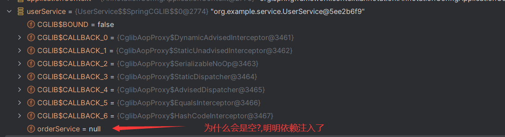

如果你还记得以前学的InvocationHandler接口应该就可以猜到了,InvocationHandler是jdk的代理方法

而这个aop使用的是cglib的动态代理

忘了可以看[Java动态代理InvocationHandler和Proxy学习笔记-CSDN博客](https://blog.csdn.net/yaomingyang/article/details/80981004?spm=1001.2014.3001.5506)

```java
//这个是博客上的例子
public class WorkHandler implements InvocationHandler {

    //代理类中的真实对象
    private Object obj;

    public WorkHandler() {
        // TODO Auto-generated constructor stub
    }
    //构造函数，给我们的真实对象赋值
    public WorkHandler(Object obj) {
        this.obj = obj;
    }

    @Override
    public Object invoke(Object proxy, Method method, Object[] args) throws Throwable {
        System.out.println(proxy.getClass());
//        System.out.println(proxy);//很明显会报错,因为会调用动态代理类的toString方法,然后又代理toString方法一直调用invoke
        System.out.println(proxy == obj);
        //在真实的对象执行之前我们可以添加自己的操作
        System.out.println("before invoke。。。");
        Object invoke = method.invoke(obj, args);
        //在真实的对象执行之后我们可以添加自己的操作
        System.out.println("after invoke。。。");
        return invoke;
    }

}
```

没错,我们的动态代理类里有我们真正代理的对象,（放到spring容器的是动态代理类）

大概类型如下图,我们动态代理类会继承要代理类的类型(为什么要继承？因为你是用动态代理类去调用的啊，动态代理类都没那个方法,咋调用)

那么也会有对应的方法,但是重写了。

重写的内容也大致就是,执行切面逻辑,然后执行,真正被代理的对象的方法

这个Map其实叫做单例池

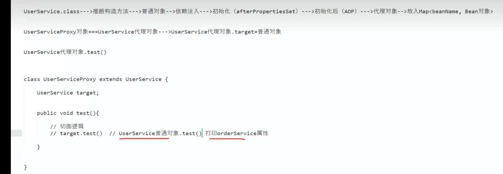

继续看调试内容会发现,就是差不多的意思

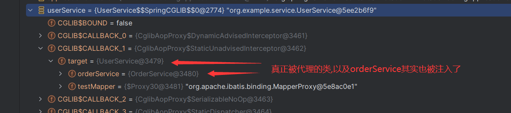

### 事务

事务其实我感觉单纯点,就咋们写代码,就是关掉自动提交

[什么是事务？_简述什么是事务-CSDN博客](https://blog.csdn.net/LLChopin/article/details/118422941?ops_request_misc=%7B%22request%5Fid%22%3A%22186A7092-4B60-4DCA-81B1-70635CC7E2D3%22%2C%22scm%22%3A%2220140713.130102334..%22%7D&request_id=186A7092-4B60-4DCA-81B1-70635CC7E2D3&biz_id=0&utm_medium=distribute.pc_search_result.none-task-blog-2~all~top_click~default-1-118422941-null-null.142^v100^control&utm_term=事务是什么&spm=1018.2226.3001.4187)

测试代码

```java
@ComponentScans({
        @ComponentScan("org.example.service")
})
@MapperScan("org.example.mapper")
//开启事务
@EnableTransactionManagement
//这里加@Configuration很重要待会说
@Configuration
public class AppConfig {

    @Bean   //单独创建一个Bean，方便之后更换
    public DataSource dataSource(){
        return new PooledDataSource("com.mysql.cj.jdbc.Driver",
                "jdbc:mysql://192.168.169.3:3306/study", "root", "123456");
    }
	
    //这个其实就是配置我们mapper用的数据源(这个这里待会会有些问题)
    @Bean
    public SqlSessionFactoryBean sqlSessionFactoryBean(){  //直接参数得到Bean对象
        SqlSessionFactoryBean bean = new SqlSessionFactoryBean();
        bean.setDataSource(dataSource());
        return bean;
    }

    //配置事务管理器用的数据源
    @Bean
    public PlatformTransactionManager transactionManager(){
        DataSourceTransactionManager transactionManager = new DataSourceTransactionManager();
        transactionManager.setDataSource(dataSource());
        return transactionManager;
    }
}
```

```java
@Mapper
public interface testMapper {
	//很简单的插入
    @Insert("insert into user (username, password) values (#{username},#{password}) ")
    public void insert(Student stu);
}
```

```java
@Component
public class UserService implements InitializingBean {
    @Resource
    testMapper testMapper;
	
    //抛出异常,可以看到数据库里没有更新,说明事务生效了
    @Transactional
    public void test(){
        Student student = new Student("wuningfeng", "123456", 2L);
        testMapper.insert(student);
        throw new NullPointerException();
    }

    //初始化方法,在依赖注入(属性赋值)之后执行
    @Override
    public void afterPropertiesSet() throws Exception {

    }
}
```

```java
public static void main(String[] args) {
    AnnotationConfigApplicationContext applicationContext = new AnnotationConfigApplicationContext(AppConfig.class);

    UserService userService = (UserService) applicationContext.getBean("userService");
    userService.test();
}
```

其实事务原理还是跟aop差不多,都是生成动态代理类（一样是生成啥UserService$$SpringCGLIB$$0@2774）,就是切面逻辑不一样

可以看下图，会发现切面逻辑里,事务管理器会提前生成一个数据库连接,而且把这个数据库连接关了,并且是在一个ThreadLocal里存入了一个map,键就是数据源,而值就是对应的连接

之后执行mapper的时候,mapper就直接就从这个map里取出连接了,而不是再自己创建连接

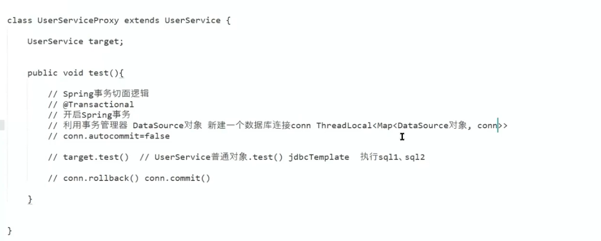

#### 问题代码1

还是之前的代码,但是UserService内部改了下,main方法里还是去调用test的

```java
@Component
public class UserService implements InitializingBean {

    @Resource
    testMapper testMapper;

    @Transactional
    public void test(){
        Student student = new Student("wuningfeng", "123456", 2L);
        testMapper.insert(student);
        a();
    }
	//解释下这个
    //这个的意思就是当前方法如果在一个事务中,就会抛出异常
    @Transactional(propagation = Propagation.NEVER)
    public void a(){
        Student student = new Student("wuningfeng", "123456", 2L);
        testMapper.insert(student);
    }
    //初始化方法,在依赖注入(属性赋值)之后执行
    @Override
    public void afterPropertiesSet() throws Exception {

    }
}
```

如果我们什么都没思考,那么就会觉得a方法不就在代理对象test方法的事务中吗

实则不是,程序运行后,并没有抛出异常,数据都插入了

原因其实很容易理解,我们调用test,然后事务开启,接着调用真正被代理的UserService类的test方法

而此时的this其实就是UserService类了不是吗,而不是代理类,那么接着直接调用a,其实也是普通的UserService类进行的调用

并不是调用代理类的a方法，那么也就不会有a方法事务相关的操作,也就不会抛出异常,因为普通对象调用a肯定不会管你@Transactional的注解啊,代理类才会管

解决方法也很简单，比如


```java
@Component
public class UserService implements InitializingBean {

    @Resource
    testMapper testMapper;
    //自己注入自己
    @Resource
    UserService userService

    @Transactional
    public void test(){
        Student student = new Student("wuningfeng", "123456", 2L);
        testMapper.insert(student);
        //这里调用的就是代理类的a方法了,执行后即抛出异常
        userService.a();
    }

    @Transactional(propagation = Propagation.NEVER)
    public void a(){
        Student student = new Student("wuningfeng", "123456", 2L);
        testMapper.insert(student);
    }
    //初始化方法,在依赖注入(属性赋值)之后执行
    @Override
    public void afterPropertiesSet() throws Exception {

    }
}
```

#### 问题代码2

```java
@ComponentScans({
        @ComponentScan("org.example.service")
})
@MapperScan("org.example.mapper")
//开启事务
@EnableTransactionManagement
//还记得一开始我们加了@Configuration
//如果我们此时注释了它,其他还是示例代码照旧
//那么抛出异常后,数据依旧被插入
//@Configuration
public class AppConfig {

    @Bean   //单独创建一个Bean，方便之后更换
    public DataSource dataSource(){
        return new PooledDataSource("com.mysql.cj.jdbc.Driver",
                "jdbc:mysql://192.168.169.3:3306/study", "root", "123456");
    }
	
    //这个其实就是配置我们mapper用的数据源
    @Bean
    public SqlSessionFactoryBean sqlSessionFactoryBean(){  //直接参数得到Bean对象
        SqlSessionFactoryBean bean = new SqlSessionFactoryBean();
        //设置数据源
        bean.setDataSource(dataSource());
        return bean;
    }

    //配置事务管理器用的数据源
    @Bean
    public PlatformTransactionManager transactionManager(){
        DataSourceTransactionManager transactionManager = new DataSourceTransactionManager();
        //设置数据源
        transactionManager.setDataSource(dataSource());
        return transactionManager;
    }
}
```

这是为什么,数据为什么还是会被插入

还记得这张图吗,这里我们发现事务管理器开启事务后,会把数据源作为key,连接作为value塞进一个map里

之后mapper等数据库操作将会根据数据源取到连接对象

但是如果我们SqlSessionFactoryBean和事务管理器PlatformTransactionManager使用的数据源不是同一个对象呢?

比如上面的bean.setDataSource(dataSource());以及 transactionManager.setDataSource(dataSource());

很显然,如果数据源不一样,SqlSessionFactoryBean也就拿不到事务管理器创建的那个数据库连接了

那么事务操作其实也就白操作了,数据库连接都不一样(SqlSessionFactoryBean从map拿不到连接,就自己创建)

所以@Configuration在这里的作用就是让dataSource()返回的是同一个对象,原理也是用的代理对象，会用AppConfig生成一个代理对象,调用的时候会判断调用的方法名字在容器里是否有这个bean,有就返回

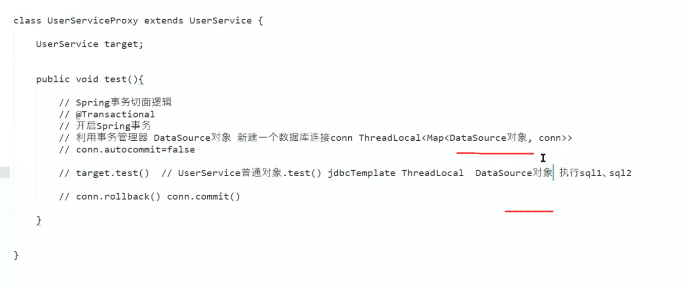

## 循环依赖

代码例子

下面例子,是可以正常执行的,但是呢,就是在想啊,创建A的时候需要B,创建B的时候需要A,这不就无线循环了吗

但是并没有报错 

```java
@Component
public class AService {
    @Resource
    BService bService;
}
```

```java
@Component
public class BService {
    @Resource
    AService aService;
}
```

那么怎么解决

第一次肯定会想,我们先创建AService,创建完了,就把AService放进一个map里保存

然后依赖注入BService，发现没有BService,那么就创建BService，

而这时候又发现BService需要AService,那么我直接从map里取到之前的AService不就都解决了吗

### 二级缓存earlySingletonObjects

**源码里是Map<String, Object> earlySingletonObjects **(DefaultSingletonBeanRegistry类)

上面会引出一个问题,就是上面我存在这个map里的,是普通的bean。

如果我依赖注入完了,AService需要进行Aop生成一个代理对象,而此时BService内的aService却是普通的AService(理应注入代理对象)

那么怎么办,这就引入了两级缓存**earlySingletonObjects**

如下图**singletonObjects**依旧就是前面说的单例池,就是完全创建好的

而且这里又出现了一个新类C，也是earlySingletonObjects需要解决的问题,B类不变,A类和C类也是循环依赖

下面统称为A类，B类, C类

大致流程如下,创建A类,填充B类,发现单例池里没有就创建B类

创建B类途中又发现需要注入A类,判断单例池里有无,无就看是否正在创建A类

发现也是,那么就意味着出现了循环依赖,从earlySingletonObjects取,看是否可以取到A类,不行就判断A类需要AOP，是的话就生成A的代理对象 (这个下面的图少写了,不需要AOP，就直接塞普通A进去)  存进earlySingletonObjects

接着填充C类,一样的套路,到earlySingletonObjects的时候直接即可取到A类,或者A的代理类

这里其实也说明了为什么需要earlySingletonObjects,如果没有earlySingletonObjects,每次我们拿到普通的A类后(怎么拿到普通A类其实是3级缓存,之后说)  如果需要AOP，都创建了新的代理类 ,那么也就意味着 B类和C类注入的A类不一样了,明显就错了

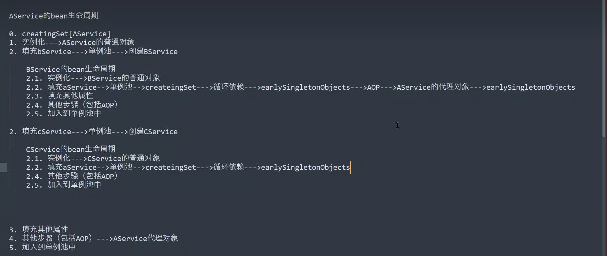

### 三级缓存singletonFactories 

**源码里是private final Map<String, ObjectFactory<?>> singletonFactories **(DefaultSingletonBeanRegistry类)

刚刚二级缓存一直说,出现了循环依赖而且需要aop的时候，需要生成代理对象，但明显我们需要一个普通的原始对象,而他就需要通过三级缓存获得

```java
//可以看到singletonFactories 的值是一个函数式接口
@FunctionalInterface
public interface ObjectFactory<T> {
    T getObject() throws BeansException;
}
```

引入了新的东西,三级缓存,大致内容其实跟上面一样,就说说不同的

每次实例化完对象(即完成构造函数) 都会把bean放到三级缓存中

接着在B类出现循环依赖,而且二级缓存找不到的时候,即从3级缓存里那到原始的对象

这里会调用singletonFactories 的值的lambda表达式,这个lambda表达式里同时会去判断是否需要进行AOP操作,其余则是正常流程

这里A可能写的有点省略,创建A的时候开头也同样一样的

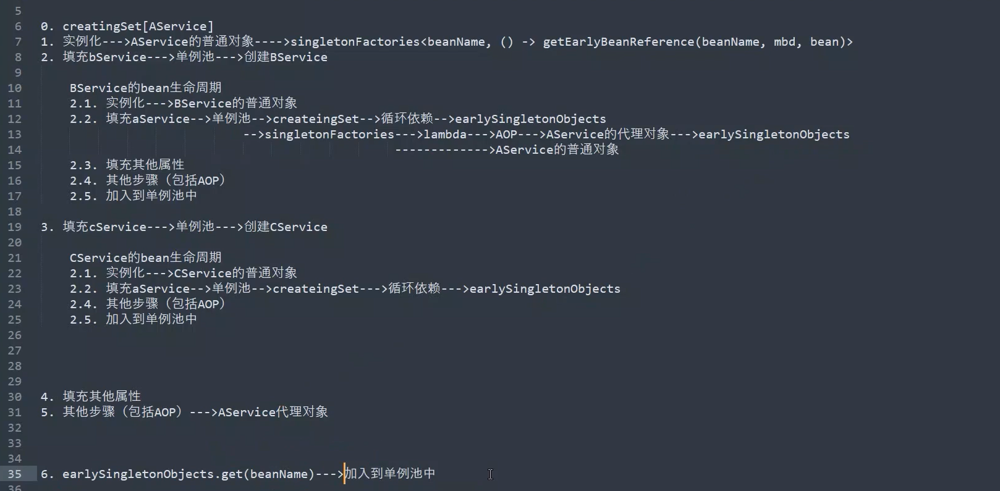

###  为什么三级缓存而不是二级缓存

其实earlySingletonObjects肯定知道是需要的,因为会可能创建多个一样的代理对象

而三级缓存singletonFactories 又是被二级缓存需要的,因为要创建代理对象

那么可能会想单例池可以删了吗,其实你就可以看看流程,就知道不行

如果单例池和二级缓存公用的话进入上图循环依赖的步骤的时候,你也会发现很多问题

### AOP操作提前了,判断是否还要AOP

如果回去看上图,会发现如果出现循环依赖和AOP，会提前生成代理对象,那么依赖注入完后,理应该就不能再进行一次AOP代理了

这个步骤是由AOP去判断的

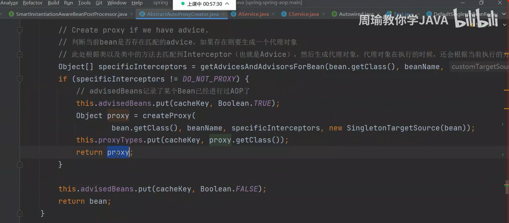

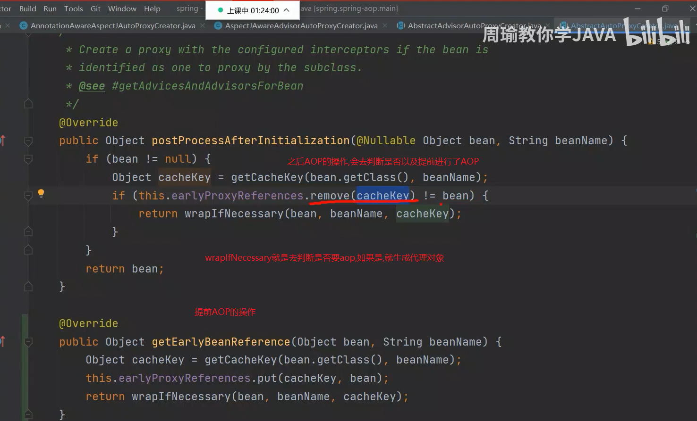

### @Lazy解决构造函数出现的循环依赖的问题

演示代码

```java
@Component
public class AService {
    public AService(BService bService){}
}
```

```java
@Component
public class BService {
    public BService(AService aService){}
}
```

报错 Requested bean is currently in creation: Is there an unresolvable circular reference?

即出现循环依赖

为什么这里的循环依赖spring没有解决

...其实很简单,这都是构造函数啊,对象都没构造出来,就出现了循环依赖,spring怎么帮我们解决

如果一定要用这个构造函数的话,解决方法也很简单,在任意类上加上@Lazy注解即可

```java
@Component
public class BService {
    @Lazy
    public BService(AService aService){}
}
```

这个@Lazy的作用是什么,也是动态代理

比如这个BService类里构造函数里加了@Lazy

它是怎么处理的呢.

构造函数运行的时候,直接生成一个AService的代理对象,继承了AService

然后每个重写的方法里做的事情,就是从Spring容器里找真正对应的bean对象。

其实很好理解

下图也有解释,当然下图它这个就是AService类的AService(BService bService)构造函数上加的@Lazy

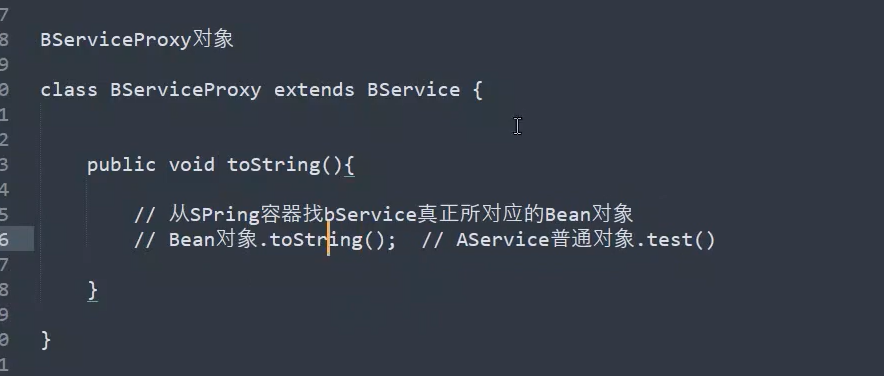


### @Scope("prototype")

如果用原型的话,会怎么样呢?，肯定也会出现循环依赖,而且spring解决不了报错

原因口头说说,如果先创建A，此时发现需要依赖注入B，发现B是原型,就创建新的B，然后创建B的时候又发现依赖A，就又创建新的A，无限循环。

原型bean的构造函数导致的循环依赖也是如此

(如果只有一个bean用了@Scope("prototype"),那么是不会报错,可以解决的	)

```JAVA
@Component
@Scope("prototype")
public class BService {

    @Resource
    AService aService;

}
```

```java
@Component
@Scope("prototype")
public class AService {

    @Resource
    BService bService;
}
```

## **Mybatis与Spring整合大致原理**

普通的Mybatis的使用

可以看到我们是创建了一个SqlSessionFactory ，然后由它来创建SqlSession,最后再得到mapper

但是其实众所周知这里的UserMapper单纯只是一个接口,那么mapper要有功能,很明显getMapper得到的是UserMapper的代理对象(jdk的代理)

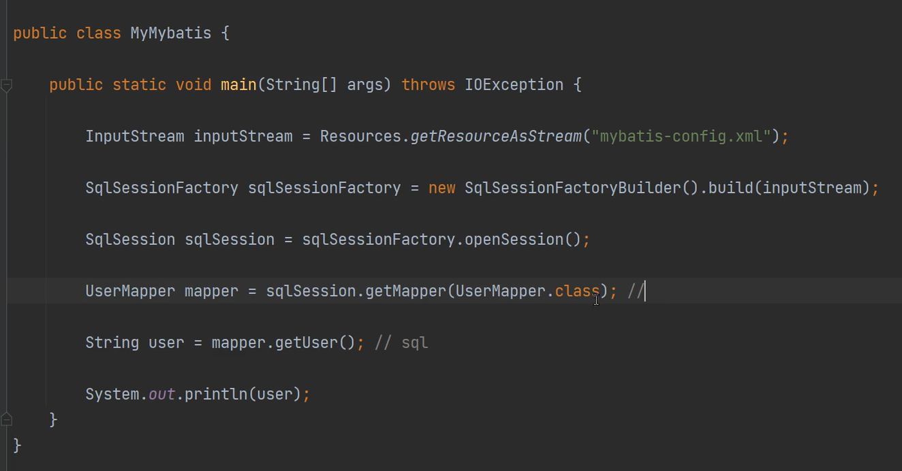

那么我们怎么把spring和mybatis进行整合

### 对mapper的代理

示例代码

```java
public interface UserMapper {
    @Insert("insert into user (username, password) values (#{username},#{password}) ")
    public void insert(Student stu);
}

```

```java
@Component
public class UserService {
    @Resource
    UserMapper userMapper;

    public void test(){
        Student student = new Student("wuningfeng", "123456", 2L);
        userMapper.insert(student);
    }
}
```

```java
@ComponentScan("org.example")
public class Test {
    public static void main(String[] args) {
        AnnotationConfigApplicationContext applicationContext = new AnnotationConfigApplicationContext(Test.class);

        UserService userService = (UserService) applicationContext.getBean("userService");
        userService.test();
    }
}
```

很明显上面的代码会报错,会报错

很明显会报错testMapper的注入失败,因为@Component只会找有@Component注册成bean,只对类有效果,对接口没有效果(因为你都生成不了对应的实现类)

那么解决办法明显就是生成对应的代理类,并且注册成bean,我们就可以这样写.就不会报错了

```JAVA
@ComponentScan("org.example")
public class Test {

    //生成一个UserMapper的代理类对象
    @Bean
    public UserMapper userMapper(){
        UserMapper proxyInstance = (UserMapper) Proxy.newProxyInstance(Test.class.getClassLoader(), new Class[]{UserMapper.class}, new InvocationHandler() {
            @Override
            public Object invoke(Object proxy, Method method, Object[] args) throws Throwable {
                System.out.println("代理方法进行");
                return null;
            }
        });
        return proxyInstance;
    }


    public static void main(String[] args) {
        AnnotationConfigApplicationContext applicationContext = new AnnotationConfigApplicationContext(Test.class);

        UserService userService = (UserService) applicationContext.getBean("userService");
        userService.test();
    }
}
```

### FactoryBean和beanDeFinition

当然实际肯定不是这么简单,mybatis整合spring会利用FactoryBean

```java
public class ZhouyuFactoryBean implements FactoryBean {
    //bean工厂生成的bean对象
    @Override
    public Object getObject() throws Exception {
        return null;
    }
	//bean工厂生成的bean对象的类型
    @Override
    public Class<?> getObjectType() {
        return null;
    }
}
```

那么我们可以把刚刚的代理对象加进去,就是

```java
//我们就可以利用这个工厂bean去生成我们的代理mapper对象
public class ZhouyuFactoryBean implements FactoryBean {
    @Override
    public Object getObject() throws Exception {
        UserMapper proxyInstance = (UserMapper) Proxy.newProxyInstance(Test.class.getClassLoader(), new Class[]{UserMapper.class}, new InvocationHandler() {
            @Override
            public Object invoke(Object proxy, Method method, Object[] args) throws Throwable {
                System.out.println("代理方法进行");
                return null;
            }
        });
        return proxyInstance;
    }

    @Override
    public Class<?> getObjectType() {
        return UserMapper.class;
    }
}
```

那么如何注册呢？那么就可以如下图所示,进行注册,UserService成功可以注入mapper的代理类

```java
@ComponentScan("org.example")
public class Test {

    public static void main(String[] args) {
        //注意这里不可以再写成AnnotationConfigApplicationContext applicationContext =
        // new AnnotationConfigApplicationContext(Test.class);
        //因为如果直接构造函数传参的话,内部会进行refresh操作,下面又会refresh一下,而GenericApplicationContext不支持多次刷新尝试
        AnnotationConfigApplicationContext applicationContext = new AnnotationConfigApplicationContext();
        applicationContext.register(Test.class);

        //声明一个beanDefinition
        AbstractBeanDefinition beanDefinition = BeanDefinitionBuilder.genericBeanDefinition().getBeanDefinition();
        beanDefinition.setBeanClass(ZhouyuFactoryBean.class);
        //参数1就是bean的名字了
        //注册工厂bean,会注册两个bean,一个是工厂,一个是工厂生成的bean
        //工厂bean的名字是&userMapper,而生成的bean的名字才是userMapper
        applicationContext.registerBeanDefinition("userMapper",beanDefinition);
        //refresh容器
        applicationContext.refresh();

        UserService userService = (UserService) applicationContext.getBean("userService", UserService.class);
        userService.test();
    }
}
```

这里有个概念,就是声明式和编程式写法,平常我们写的这些@Bean,@Componet,以及标签bean来生成bean的都是声明式写法

而直接用BeanDefinition注册的是编程式写法

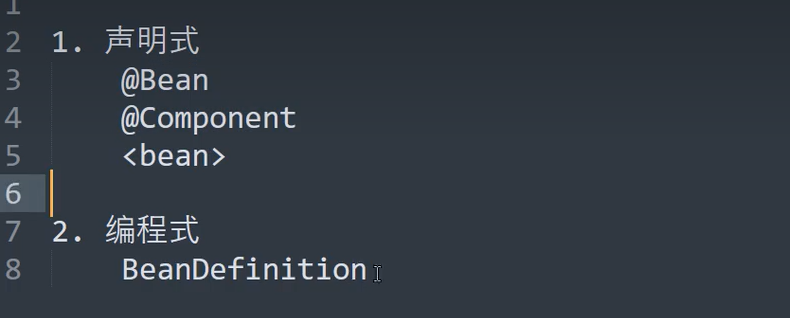

上面这样写确实没问题,但是有个问题，如果我不仅有UserMapper接口,还有OrderMapper接口,还有其他很多呢?

如果我们还是这样写,那么我们这得创建多少工厂bean啊,所以得改善

那么我们就可以在工厂bean里定义一个类型对象,来指定mapper的类型

```JAVA
public class ZhouyuFactoryBean implements FactoryBean {
	//定义对应的mapper类型
    private Class mapperClass;

    //到时候传参即可
    public ZhouyuFactoryBean(Class mapperClass){
        this.mapperClass = mapperClass;
    }
    @Override
    public Object getObject() throws Exception {
        Object proxyInstance =  Proxy.newProxyInstance(ZhouyuFactoryBean.class.getClassLoader(), new Class[]{mapperClass}, new InvocationHandler() {
            @Override
            public Object invoke(Object proxy, Method method, Object[] args) throws Throwable {
                System.out.println(method.getName());
                return null;
            }
        });
        return proxyInstance;
    }

    @Override
    public Class<?> getObjectType() {
        return mapperClass;
    }
}
```

那么怎么传参呢?,以前的注释还在,这里,我在userService又注入了一个OrderMapper

关键看 beanDefinition1.getConstructorArgumentValues().addGenericArgumentValue(UserMapper.class);

```java
public static void main(String[] args) {
    //注意这里不可以再写成AnnotationConfigApplicationContext applicationContext =
    // new AnnotationConfigApplicationContext(Test.class);
    //因为如果直接构造函数传参的话,内部会进行refresh操作,下面又会refresh一下,而GenericApplicationContext不支持多次刷新尝试
    AnnotationConfigApplicationContext applicationContext = new AnnotationConfigApplicationContext();
    applicationContext.register(Test.class);

    //声明一个beanDefinition
    AbstractBeanDefinition beanDefinition1 = BeanDefinitionBuilder.genericBeanDefinition().getBeanDefinition();
    beanDefinition1.setBeanClass(ZhouyuFactoryBean.class);
    //给构造方法传参！！
    beanDefinition1.getConstructorArgumentValues().addGenericArgumentValue(UserMapper.class);
    //参数1就是bean的名字了
    //注册工厂bean,会注册两个bean,一个是工厂,一个是工厂生成的bean
    //工厂bean的名字是&userMapper,而生成的bean的名字才是userMapper
    applicationContext.registerBeanDefinition("userMapper",beanDefinition1);


    //声明一个beanDefinition
    AbstractBeanDefinition beanDefinition2 = BeanDefinitionBuilder.genericBeanDefinition().getBeanDefinition();
    beanDefinition2.setBeanClass(ZhouyuFactoryBean.class);
    //给构造方法传参！！
    beanDefinition2.getConstructorArgumentValues().addGenericArgumentValue(OrderMapper.class);
    //参数1就是bean的名字了
    //注册工厂bean,会注册两个bean,一个是工厂,一个是工厂生成的bean
    //工厂bean的名字是&userMapper,而生成的bean的名字才是userMapper
    applicationContext.registerBeanDefinition("orderMapper",beanDefinition2);

    //refresh容器
    applicationContext.refresh();

    UserService userService = (UserService) applicationContext.getBean("userService", UserService.class);
    userService.test();
}
```

### ImportBeanDefinitionRegistrar

可以发现上面这样写main方法里全是代码,那么可能得要简化，那么就用了ImportBeanDefinitionRegistrar

这个其实以前学过,就是呢@Import注解,就是直接把import里的类注册成bean,而如果这个类实现了ImportBeanDefinitionRegistrar接口,还会执行这个接口里的registerBeanDefinitions方法

那么我们就可以把刚刚注册代理mapper bean的代码都放到registerBeanDefinitions方法里

```java
public class ZhouyuImportBeanDefinitionRegistrar implements ImportBeanDefinitionRegistrar {
    //直接把注册代理mapper的代码放到了registerBeanDefinitions里
    @Override
    public void registerBeanDefinitions(AnnotationMetadata importingClassMetadata, BeanDefinitionRegistry registry{
        //声明一个beanDefinition
        AbstractBeanDefinition beanDefinition1 = BeanDefinitionBuilder.genericBeanDefinition().getBeanDefinition();
        beanDefinition1.setBeanClass(ZhouyuFactoryBean.class);
        beanDefinition1.getConstructorArgumentValues().addGenericArgumentValue(UserMapper.class);
        //注册
        registry.registerBeanDefinition("userMapper",beanDefinition1);

        //声明一个beanDefinition
        AbstractBeanDefinition beanDefinition2 = BeanDefinitionBuilder.genericBeanDefinition().getBeanDefinition();
        beanDefinition2.setBeanClass(ZhouyuFactoryBean.class);
        beanDefinition2.getConstructorArgumentValues().addGenericArgumentValue(OrderMapper.class);
        //注册
        registry.registerBeanDefinition("orderMapper",beanDefinition2);
    }
}
```

```java
@ComponentScan("org.example")
@Import(ZhouyuImportBeanDefinitionRegistrar.class)
public class Test {

    public static void main(String[] args) {
        //注意这里不可以再写成AnnotationConfigApplicationContext applicationContext =
        // new AnnotationConfigApplicationContext(Test.class);
        //因为如果直接构造函数传参的话,内部会进行refresh操作,下面又会refresh一下,而GenericApplicationContext不支持多次刷新尝试
        AnnotationConfigApplicationContext applicationContext = new AnnotationConfigApplicationContext();
        applicationContext.register(Test.class);
        //refresh容器
        applicationContext.refresh();

        UserService userService = (UserService) applicationContext.getBean("userService", UserService.class);
        userService.test();
    }
}
```

### ClassPathBeanDefinitionScanner

上面的代码还有些许问题,比如在注册mapper的代理类的时候,我们需要手动传代理的接口类UserMapper.class，OrderMapper.class

如果要代理的接口类有100个,那我难道就得写全部一个一个手写传进去吗

有什么方法可以不传?

这里就用到了ClassPathBeanDefinitionScanner接口

这个是Spring的扫描(就是我们平常@ComponentScan就用的这个),默认的扫描逻辑如下

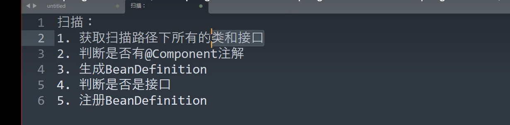

但是现在我们扫描只要接口即可

```java
public class ZhouyuScanner extends ClassPathBeanDefinitionScanner {
    //拿到用于注册bean的registry
    public ZhouyuScanner(BeanDefinitionRegistry registry) {
        super(registry);
    }

    @Override
    protected boolean isCandidateComponent(MetadataReader metadataReader) throws IOException {
        //默认扫描逻辑是判断是否有@Component注解
        //但现在我们就直接全部返回true,都要,不管是否有@Component注解
        //这个逻辑通过之过就会生成bean的定义BeanDefinition
//        return super.isCandidateComponent(metadataReader);
        return true;
    }

    @Override
    protected boolean isCandidateComponent(AnnotatedBeanDefinition beanDefinition) {
    //在此之前通过了 isCandidateComponent(MetadataReader metadataReader) 生成了beanDefinition
    //默认处理 逻辑是判断是不是接口,是就不通过 (因为默认要既有@Component注解,也要是个类,才能被注册成bean啊)
//        return super.isCandidateComponent(beanDefinition);
        //现在处理逻辑,就变成了只要是接口才可以通过
        return beanDefinition.getMetadata().isInterface();
    }

    @Override
    protected Set<BeanDefinitionHolder> doScan(String... basePackages) {
        //super.doScan就是spring默认的扫描逻辑,我经过上面两个函数的判断
        //而且super.doScan里就把我们经过判断扫描得到的BeanDefinition注册成到registry
        Set<BeanDefinitionHolder> beanDefinitionHolders = super.doScan(basePackages);
        
        //我们现在就要修改注册到registry里的BeanDefinition(因为spring现在都还没refresh啊,还没开始创建bean呢,当然可以再修改)
        for (BeanDefinitionHolder beanDefinitionHolder : beanDefinitionHolders) {
            //拿到扫描得到的bean的定义,这里得到bean还是普通的mapper接口
            GenericBeanDefinition beanDefinition = (GenericBeanDefinition) beanDefinitionHolder.getBeanDefinition();
            //设置bean构造函数的参数,就是此时bean定义的类名(UserMapper.class等等)
            beanDefinition.getConstructorArgumentValues().addGenericArgumentValue(beanDefinition.getBeanClassName());
            //此时再设置bean定义的类型,为工厂bean
            //千万别后面两句话写反了,因为一开始bean定义的类名就是mapper接口名字啊。
            //如果写反了,你就先把bean定义的类名覆盖了,拿不到构造函数的参数了啊
            beanDefinition.setBeanClass(ZhouyuFactoryBean.class);
        }
        return beanDefinitionHolders;
    }
}

```

而此时我们的ZhouyuImportBeanDefinitionRegistrar内只要让zhouyuScanner去扫描mapper所在的包即可

此时运行,结果依旧可以成功

```java
public class ZhouyuImportBeanDefinitionRegistrar implements ImportBeanDefinitionRegistrar {
    @Override
    public void registerBeanDefinitions(AnnotationMetadata importingClassMetadata, BeanDefinitionRegistry registry) {
        //扫描路径
        String path = "org.example.mapper";

        ZhouyuScanner zhouyuScanner = new ZhouyuScanner(registry);
        zhouyuScanner.doScan(path);
    }
}
```

### 更改FactoryBean的生成代理类的方法

现在还是有一些问题,我们一开始呢是为了测试,工厂bean里getObject()方法就是随便生成了一个代理对象

而实际上生成代理对象应该是getMapper这个方法做的,那么我们就要来修改一下


```java
public class ZhouyuFactoryBean implements FactoryBean {

    private Class mapperClass;

    private SqlSession sqlSession;

    public ZhouyuFactoryBean(Class mapperClass){
        this.mapperClass = mapperClass;
    }
    //依赖注入SqlSessionFactory,来生成SqlSession
    //跟以前的很像,这里可能@Autowired冒红线,但是可以运行
    //注意一下我们是SqlSessionFactory注册成了bean,sqlSession并没有,也就是说其实@Autowired只是对方法参数进行依赖注入
    @Autowired
    public void setSqlSession(SqlSessionFactory sqlSessionFactory){
        //org.example.mapper.UserMapper is not known to the MapperRegistry.
        //这句话也需要配置不然报上面的错误
        sqlSessionFactory.getConfiguration().addMapper(mapperClass);
        //true是设置自动提交
        this.sqlSession = sqlSessionFactory.openSession(true);
    }

    @Override
    public Object getObject() throws Exception {
        //mybatis底层也是用jdk的动态代理的
        return sqlSession.getMapper(mapperClass);
    }

    @Override
    public Class<?> getObjectType() {
        return mapperClass;
    }
}
```

很明显我们的SqlSessionFactory也需要注册成bean,这个肯定就需要人工去写了

spring和mybatis肯定不知道你数据库在哪里啊

```JAVA
@ComponentScan("org.example")
@Import(ZhouyuImportBeanDefinitionRegistrar.class)
public class Test {


    //把SqlSessionFactory也注册成bean,即可正常运行,mapper的代理对象正确生成,数据库里也被正确操作
    @Bean
    public SqlSessionFactory sqlSessionFactoryBean() throws IOException {
        InputStream resourceAsStream = Resources.getResourceAsStream("mybatis.xml");
        SqlSessionFactory sqlSessionFactory = new SqlSessionFactoryBuilder().build(resourceAsStream);
        return sqlSessionFactory;
    }


    public static void main(String[] args) throws IOException {
        AnnotationConfigApplicationContext applicationContext = new AnnotationConfigApplicationContext();
        applicationContext.register(Test.class);
        //refresh容器
        applicationContext.refresh();

        UserService userService = (UserService) applicationContext.getBean("userService", UserService.class);
        userService.test();
    }
}

```

```java
public class Student {
    private Teacher teacher;
	
    //这是以前的,会觉得其实是Teacher注册成了bean
    //但是事实上是对方法的参数进行了依赖注入,方法里你想咋写就咋写了
    @Autowired
    public void setTeacher(Teacher teacher) {
        this.teacher = teacher;
    }
}
```

### @MapperScan

现在还有最后一个问题,就是我们的路径啊,就是我们扫描mapper的路径,还是自己手写的,那这怎么行啊

那要咋搞,mybatis就是用的@MapperScan,那么我们也写个差不多的

```java
@Target({ElementType.TYPE})
@Retention(RetentionPolicy.RUNTIME)
//把Import的也放到这里
@Import(ZhouyuImportBeanDefinitionRegistrar.class)
public @interface ZhouyuScan {
    String value();
}
```

```java
@ComponentScan("org.example")
//写上自定义的注解,而且把mapper的扫描路径传给它
@ZhouyuScan("org.example.mapper")
public class Test {

    @Bean
    public SqlSessionFactory sqlSessionFactoryBean() throws IOException {  //直接参数得到Bean对象
        InputStream resourceAsStream = Resources.getResourceAsStream("mybatis.xml");
        SqlSessionFactory sqlSessionFactory = new SqlSessionFactoryBuilder().build(resourceAsStream);
        return sqlSessionFactory;
    }


    public static void main(String[] args) throws IOException {
        AnnotationConfigApplicationContext applicationContext = new AnnotationConfigApplicationContext();
        applicationContext.register(Test.class);
        //refresh容器
        applicationContext.refresh();

        UserService userService = (UserService) applicationContext.getBean("userService", UserService.class);
        userService.test();

    }
}
```

```java
public class ZhouyuImportBeanDefinitionRegistrar implements ImportBeanDefinitionRegistrar {
    @Override
    public void registerBeanDefinitions(AnnotationMetadata importingClassMetadata, BeanDefinitionRegistry registry{
        //获得扫描路径
        //这里的第一个参数importingClassMetadata,可以拿到注解的值
        //就可以理解成ZhouyuScan注解会把value值传过来
        Map<String, Object> annotationAttributes = 	importingClassMetadata.getAnnotationAttributes(ZhouyuScan.class.getName());
        String path = (String) annotationAttributes.get("value");

        ZhouyuScanner zhouyuScanner = new ZhouyuScanner(registry);
        zhouyuScanner.doScan(path);
    }
}
```

之后正常运行

### 优化点

```java
public class ZhouyuFactoryBean implements FactoryBean {

    private SqlSession sqlSession;
	//这里不设置@AutoWired注解
    //那么这里肯定就报错了,怎么做
    public void setSqlSession(SqlSessionFactory sqlSessionFactory){
        sqlSessionFactory.getConfiguration().addMapper(mapperClass);
        this.sqlSession = sqlSessionFactory.openSession(true);
    }
    .....
}
```

```java
@Override
protected Set<BeanDefinitionHolder> doScan(String... basePackages) {
    Set<BeanDefinitionHolder> beanDefinitionHolders = super.doScan(basePackages);
    for (BeanDefinitionHolder beanDefinitionHolder : beanDefinitionHolders) {
        GenericBeanDefinition beanDefinition = (GenericBeanDefinition) beanDefinitionHolder.getBeanDefinition();
        beanDefinition.getConstructorArgumentValues().addGenericArgumentValue(beanDefinition.getBeanClassName());
        beanDefinition.setBeanClass(ZhouyuFactoryBean.class);
        
        //给注册的工厂bean设置自动注入即可	
        //这样工厂bean里所有的set方法都会执行,参数会依赖注入,用的少,因为太全了,不好控制
         beanDefinition.setAutowireMode(AbstractBeanDefinition.AUTOWIRE_BY_TYPE);
    }
    return beanDefinitionHolders;
}
```

# 手写spring

## 基础架构

```java
//ComponentScan扫描包用的，肯定要
@Retention(RetentionPolicy.RUNTIME)
@Target(ElementType.TYPE)
public @interface ComponentScan {

    String value() default "";
}
```

```java
@Retention(RetentionPolicy.RUNTIME)
@Target(ElementType.TYPE)
public @interface Component {

    String value() default "";
}
```

```java
//手写的ApplicationContext
public class ZhouyuApplicationContext {
    //配置类
    private Class configClass;

    public ZhouyuApplicationContext(Class configClass) {
        this.configClass = configClass;

        //解析配置类
        //Component注解--》扫描路径--》扫描
    }

    public Object getBean(String beanName){
        return null;
    }
}
```

项目内部

```JAVA
//配置扫描路径
@ComponentScan("com.zhouyu.service")
public class AppConfig {
}
```

```java
@Component
public class UserService {
	
}
```

```java
public class Test {
    public static void main(String[] args) {
        ZhouyuApplicationContext zhouyuApplicationContext = new ZhouyuApplicationContext(AppConfig.class);

        Object userService = zhouyuApplicationContext.getBean("userService");

    }
}
```

## ZhouyuApplicationContext配置

```java
public class ZhouyuApplicationContext {
    private Class configClass;

    public ZhouyuApplicationContext(Class configClass) {
        this.configClass = configClass;

        //解析配置类
        //Component注解--》扫描路径--》扫描
        //拿到ComponentScan注解
        ComponentScan componentScanAnnotation = (ComponentScan) configClass.getDeclaredAnnotation(ComponentScan.class);
        String path = componentScanAnnotation.value(); //扫描路径
        System.out.println(path);
    }

    public Object getBean(String beanName){
        return null;
    }
}
```

### classpath

这里提一下类路径classpath,如果你没忘的就知道是啥，我们还有一些方法可以查看

编译以后，看下方的控制台的第一句话，太长了,我复制出来看看

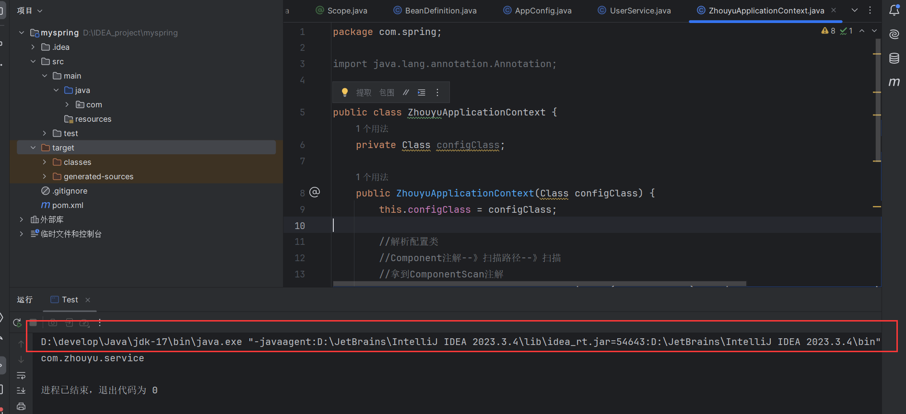

```
D:\develop\Java\jdk-17\bin\java.exe "-javaagent:D:\JetBrains\IntelliJ IDEA 2023.3.4\lib\idea_rt.jar=54643:D:\JetBrains\IntelliJ IDEA 2023.3.4\bin" -Dfile.encoding=UTF-8 -classpath D:\IDEA_project\myspring\target\classes com.zhouyu.Test
可以看到最后面-classpath D:\IDEA_project\myspring\target\classes,这个就是我们的类路径
```

我们现在得到了我们包扫描的路径,那么现在就应该用类加载器加载包下面的.class文件了

```java
public class ZhouyuApplicationContext {
    private Class configClass;

    public ZhouyuApplicationContext(Class configClass) {
        this.configClass = configClass;

        //解析配置类
        //Component注解--》扫描路径--》扫描
        //拿到ComponentScan注解
        ComponentScan componentScanAnnotation = (ComponentScan) configClass.getDeclaredAnnotation(ComponentScan.class);
        String path = componentScanAnnotation.value(); //扫描路径

        //扫描
        //3种类加载器,忘了可以去网上查
        //Bootstrap--->加载jre/lib
        //Ext--->加载jre/ext/lib
        //App--->加载classpath下的

        //得到类加载器
        ClassLoader classLoader = ZhouyuApplicationContext.class.getClassLoader();
        //把.替换成/ ,就变成了com/zhouyu/service
        path = path.replace(".","/");
        //这个需要用com/zhouyu/service,而不能是com.zhouyu.service
        URL resource = classLoader.getResource(path);
        //拿到对应的文件
        File file = new File(resource.getFile());
        if(file.isDirectory()){

            File[] files = file.listFiles();
            for (File f : files) {
                //得到绝对路径比如D:\IDEA_project\myspring\target\classes\com\zhouyu\service\UserService.class
                String fileName = f.getAbsolutePath();
                //需要加载的是.class结尾的
                if(fileName.endsWith(".class")){
                    //截取成com\zhouyu\service\UserService
                    String className = fileName.substring(fileName.indexOf("com"),fileName.indexOf(".class"));
                    //把\替换成. 因为是\是转义啊,所以要两个\\,不然"\",\就是转义后面的"了
                    //com.zhouyu.service.UserService
                    className = className.replace("\\",".");
                    System.out.println(className);

                    try {
                        //有了com.zhouyu.service.UserService就可以用应用类加载器去加载了
                        //因为这个加载器是默认从类路径下加载的啊
                        //这里简单说个小点,为什么命名成clazz,因为class是关键字啊,用不了,又想表达这个意思,歪果人就习惯写成clazz
                        Class<?> clazz  = classLoader.loadClass(className);
                        if(clazz.isAnnotationPresent(Component.class)){
                            //...
                        }

                    } catch (ClassNotFoundException e) {
                        throw new RuntimeException(e);
                    }
                }
            }
        }

    }

    public Object getBean(String beanName){
        return null;
    }
}
```

挺简单的上面代码,就是拿到类路径下的class名字,用类加载器去加载每一个class

但是之后呢?我们现在做的事情就是扫描这一个阶段,还不需要就是把bean注册到单例池里，而且如果是原型bean的话就不应该注册到单例池里,那么原型bean 又该怎么办呢,难道我每次getBean都需要用扫描器你给的扫描路径,然后又重复上面的操作拿到class吗？

很明显不是,这时候就需要一个新的东西**BeanDefinition**

### BeanDefinition

```java
//注意这里没有存放bean的名字
public class BeanDefinition {

    //Bean的类型
    private Class clazz;

    //Bean的作用域,是单例还是原型
    private String scope;


    public Class getClazz() {
        return clazz;
    }

    public void setClazz(Class clazz) {
        this.clazz = clazz;
    }
    public String getScope() {
        return scope;
    }

    public void setScope(String scope) {
        this.scope = scope;
    }
}
```

```java
//再加一个简单的@Scope注解
@Retention(RetentionPolicy.RUNTIME)
@Target(ElementType.TYPE)
public @interface Scope {
    String value();
}
```

### Scan

根据刚刚的bean定义,以及我们对bean创建的理解,可以继续向下写

```java
public class ZhouyuApplicationContext {
    private Class configClass;

    //单例池
    private ConcurrentHashMap<String, Object> singletonObjects = new ConcurrentHashMap<>();

    private ConcurrentHashMap<String, BeanDefinition> beanDefinitionMap = new ConcurrentHashMap<>();
    public ZhouyuApplicationContext(Class configClass) {
        this.configClass = configClass;

        //解析配置类
        //Component注解--》扫描路径--》扫描
        //拿到ComponentScan注解
        ComponentScan componentScanAnnotation = (ComponentScan) configClass.getDeclaredAnnotation(ComponentScan.class);
        String path = componentScanAnnotation.value(); //扫描路径

        //扫描
        //3种类加载器,忘了可以去网上查
        //Bootstrap--->加载jre/lib
        //Ext--->加载jre/ext/lib
        //App--->加载classpath下的

        //得到类加载器
        ClassLoader classLoader = ZhouyuApplicationContext.class.getClassLoader();
        //把.替换成/ ,就变成了com/zhouyu/service
        path = path.replace(".","/");
        //这个需要用com/zhouyu/service,而不能是com.zhouyu.service
        URL resource = classLoader.getResource(path);
        //拿到对应的文件
        File file = new File(resource.getFile());
        if(file.isDirectory()){

            File[] files = file.listFiles();
            for (File f : files) {
                //得到绝对路径比如D:\IDEA_project\myspring\target\classes\com\zhouyu\service\UserService.class
                String fileName = f.getAbsolutePath();
                //需要加载的是.class结尾的
                if(fileName.endsWith(".class")){
                    //截取成com\zhouyu\service\UserService
                    String className = fileName.substring(fileName.indexOf("com"),fileName.indexOf(".class"));
                    //把\替换成. 因为是\是转义啊,所以要两个\\,不然"\",\就是转义后面的"了
                    //com.zhouyu.service.UserService
                    className = className.replace("\\",".");
                    System.out.println(className);

                    try {
                        //有了com.zhouyu.service.UserService就可以用应用类加载器去加载了
                        //因为这个加载器是默认从类路径下加载的啊
                        //这里简单说个小点,为什么命名成clazz,因为class是关键字啊,用不了,又想表达这个意思,歪果人就习惯写成clazz
                        Class<?> clazz  = classLoader.loadClass(className);
                        //判断是否有Component注解,有才会被注册到BeanDefinition中
                        if(clazz.isAnnotationPresent(Component.class)){
                            Component declaredAnnotation = clazz.getDeclaredAnnotation(Component.class);
                            //从Component注解上拿到bean的名字
                            String beanName = componentScanAnnotation.value();
                            //创建bean的定义,无论你是单例bean,还是原型bean
                            BeanDefinition beanDefinition = new BeanDefinition();
                            //设置bean定义的类型
                            beanDefinition.setClazz(clazz);
                            //根据scope注解,设置bean定义的作用域
                            if(clazz.isAnnotationPresent(Scope.class)) {
                                Scope scopeAnnotation = clazz.getDeclaredAnnotation(Scope.class);
                                beanDefinition.setScope(scopeAnnotation.value());
                            } else {
                                beanDefinition.setScope("singleton");
                            }
                            //无论是单例bean,还是原型bean都会创建bean的定义,并且放到beanDefinitionMap里
                            beanDefinitionMap.put(beanName, beanDefinition);
                        }

                    } catch (ClassNotFoundException e) {
                        throw new RuntimeException(e);
                    }
                }
            }
        }

    }

    public Object getBean(String beanName){
        //从bean定义里看看有没有这个bean
        //因为无论是原型bean还是单例bean,它的数据都会放到beanDefinitionMap里
        if(beanDefinitionMap.containsKey(beanName)) {
            BeanDefinition beanDefinition = beanDefinitionMap.get(beanName);
            //如果是单例bean,就直接从单例池里拿
            if(beanDefinition.getScope().equals("singleton")){
                Object o = singletonObjects.get(beanName);
                return o ;
            } else{
                // 创建原型bean
                // 这个下面写,就是现在就简单随便实现一下
                return createBean(beanDefinition);
            }
        } else {
            //没有对应的bean,随便拿的异常
            throw new NullPointerException("不存在对应的bean");
        }
    }
```

很好了,但是现在还没给单例池赋值,而且扫描的代码太长了

其实我们扫描就是从扫描路径里,用类加载器加载class,然后根据class上的注解注册bean定义

我们可以把这些操作都放到scan函数里

```java
private void scan(Class configClass) {
    ComponentScan componentScanAnnotation = (ComponentScan) configClass.getDeclaredAnnotation(ComponentScan.class);
    String path = componentScanAnnotation.value(); //扫描路径
    //扫描
    //3种类加载器,忘了可以去网上查
    //Bootstrap--->加载jre/lib
    //Ext--->加载jre/ext/lib
    //App--->加载classpath下的

    //得到类加载器
    ClassLoader classLoader = ZhouyuApplicationContext.class.getClassLoader();
    //把.替换成/ ,就变成了com/zhouyu/service
    path = path.replace(".","/");
    //这个需要用com/zhouyu/service,而不能是com.zhouyu.service
    URL resource = classLoader.getResource(path);
    //拿到对应的文件
    File file = new File(resource.getFile());
    if(file.isDirectory()){

        File[] files = file.listFiles();
        for (File f : files) {
            //得到绝对路径比如D:\IDEA_project\myspring\target\classes\com\zhouyu\service\UserService.class
            String fileName = f.getAbsolutePath();
            //需要加载的是.class结尾的
            if(fileName.endsWith(".class")){
                //截取成com\zhouyu\service\UserService
                String className = fileName.substring(fileName.indexOf("com"),fileName.indexOf(".class"));
                //把\替换成. 因为是\是转义啊,所以要两个\\,不然"\",\就是转义后面的"了
                //com.zhouyu.service.UserService
                className = className.replace("\\",".");
                System.out.println(className);

                try {
                    //有了com.zhouyu.service.UserService就可以用应用类加载器去加载了
                    //因为这个加载器是默认从类路径下加载的啊
                    //这里简单说个小点,为什么命名成clazz,因为class是关键字啊,用不了,又想表达这个意思,歪果人就习惯写成clazz
                    Class<?> clazz  = classLoader.loadClass(className);
                    //判断是否有Component注解,有才会被注册到BeanDefinition中
                    if(clazz.isAnnotationPresent(Component.class)){
                        Component declaredAnnotation = clazz.getDeclaredAnnotation(Component.class);
                        //从Component注解上拿到bean的名字
                        String beanName = componentScanAnnotation.value();
                        //创建bean的定义,无论你是单例bean,还是原型bean
                        BeanDefinition beanDefinition = new BeanDefinition();
                        //设置bean定义的类型
                        beanDefinition.setClazz(clazz);
                        //根据scope注解,设置bean定义的作用域
                        if(clazz.isAnnotationPresent(Scope.class)) {
                            Scope scopeAnnotation = clazz.getDeclaredAnnotation(Scope.class);
                            beanDefinition.setScope(scopeAnnotation.value());
                        } else {
                            beanDefinition.setScope("singleton");
                        }
                        //无论是单例bean,还是原型bean都会创建bean的定义,并且放到beanDefinitionMap里
                        beanDefinitionMap.put(beanName, beanDefinition);
                    }

                } catch (ClassNotFoundException e) {
                    throw new RuntimeException(e);
                }
            }
        }
    }
}
```

我们接下来就可以

```JAVA
public ZhouyuApplicationContext(Class configClass) {
    this.configClass = configClass;
    //解析配置类
    //Component注解--》扫描路径--》扫描
    scan(configClass);
    //通过上面的扫描,我们就得到了所有的bean定义
    //现在就来弄我们的单例池
    //遍历bean定义
    for (Map.Entry<String, BeanDefinition> entry : beanDefinitionMap.entrySet()) {
        String beanName = entry.getKey();
        BeanDefinition beanDefinition = entry.getValue();
        //如果bean是单例的,就创建bean,而且放进单例池中
        if(beanDefinition.getScope().equals("singleton")) {
            //创建bean对象,bean定义里都有bean的class,那么就可以用反射创建了
            Object bean = createBean(beanDefinition);
            singletonObjects.put(beanName, bean);
        }
    }
}
```

```java
private Object createBean(BeanDefinition beanDefinition) {
    Class clazz = beanDefinition.getClazz();
    try {
        Object instance = clazz.getDeclaredConstructor().newInstance();
        return instance;
    } catch (InstantiationException e) {
        throw new RuntimeException(e);
    } catch (IllegalAccessException e) {
        throw new RuntimeException(e);
    } catch (InvocationTargetException e) {
        throw new RuntimeException(e);
    } catch (NoSuchMethodException e) {
        throw new RuntimeException(e);
    }
}
```

//到此,程序大致可以正常运行,注意记得写成@Component("userService"),因为我们没有写默认值为类名什么的逻辑

## 简单的依赖注入

基础代码

```java
@Retention(RetentionPolicy.RUNTIME)
@Target({ElementType.METHOD, ElementType.FIELD})
public @interface AutoWired {

}
```

```java
@Component("userService")
public class UserService {

    @AutoWired
    private OrderService orderService;

    public void test(){
        System.out.println(this.orderService);
    }
}
```

```java
@Component("orderService")
public class OrderService {
}
```

依赖注入写的位置肯定就是在创建bean对象的时候了

之前的代码

```java
private Object createBean(BeanDefinition beanDefinition) {
    Class clazz = beanDefinition.getClazz();
    try {
        Object instance = clazz.getDeclaredConstructor().newInstance();
		
        //依赖注入
        return instance;
    } catch (InstantiationException e) {
        throw new RuntimeException(e);
    } catch (IllegalAccessException e) {
        throw new RuntimeException(e);
    } catch (InvocationTargetException e) {
        throw new RuntimeException(e);
    } catch (NoSuchMethodException e) {
        throw new RuntimeException(e);
    }
}
```

```java
private Object createBean(BeanDefinition beanDefinition) {
    Class clazz = beanDefinition.getClazz();
    try {
        Object instance = clazz.getDeclaredConstructor().newInstance();

        //依赖注入
        //就是遍历每一个字段,看看是否有AutoWired注解
        //之后就依赖注入,这里只是简单的注入了,循环依赖啥的都没管
        for (Field declaredField : clazz.getDeclaredFields()) {
            if(declaredField.isAnnotationPresent(AutoWired.class)) {
                Object bean = getBean(declaredField.getName());
                declaredField.setAccessible(true);
                declaredField.set(instance,bean);
            }
        }

        return instance;
    } catch (InstantiationException e) {
        throw new RuntimeException(e);
    } catch (IllegalAccessException e) {
        throw new RuntimeException(e);
    } catch (InvocationTargetException e) {
        throw new RuntimeException(e);
    } catch (NoSuchMethodException e) {
        throw new RuntimeException(e);
    }
}
```

## BeanNameAware接口

应该都用过把,那么看看怎么去实现它 

```java
public interface BeanNameAware {
    void setBeanName(String name);
}
```

```JAVA
@Component("userService")
public class UserService implements BeanNameAware {

    @AutoWired
    private OrderService orderService;

    //bean的名字
    private String beanName;

    public void test(){
        System.out.println(this.orderService);
    }

    @Override
    public void setBeanName(String name) {
        this.beanName = name;
    }
}
```

```java
//方法参数改下,多个beanName(之前调用的地方,都有现成的beanName)
private Object createBean(String beanName, BeanDefinition beanDefinition) {
    Class clazz = beanDefinition.getClazz();
    try {
        Object instance = clazz.getDeclaredConstructor().newInstance();

        //依赖注入
        //就是遍历每一个字段,看看是否有AutoWired注解
        //之后就依赖注入,这里只是简单的注入了,循环依赖啥的都没管
        for (Field declaredField : clazz.getDeclaredFields()) {
            if(declaredField.isAnnotationPresent(AutoWired.class)) {
                Object bean = getBean(declaredField.getName());
                declaredField.setAccessible(true);
                declaredField.set(instance,bean);
            }
        }
        //BeanNameAware接口处理
        if(instance instanceof BeanNameAware) {
            ((BeanNameAware)instance).setBeanName(beanName);
        }

        return instance;
    } catch (InstantiationException e) {
        throw new RuntimeException(e);
    } catch (IllegalAccessException e) {
        throw new RuntimeException(e);
    } catch (InvocationTargetException e) {
        throw new RuntimeException(e);
    } catch (NoSuchMethodException e) {
        throw new RuntimeException(e);
    }
}
```

## InitializingBean()接口

初始化的接口,应该再熟悉不过了

处理方法和BeanNameAware类似

```java
public interface InitializingBean {

    void afterPropertiesSet() throws Exception;
}
```

```java
@Component("userService")
public class UserService implements BeanNameAware, InitializingBean {

    @AutoWired
    private OrderService orderService;

    //bean的名字
    private String beanName;

    public void test(){
        System.out.println(this.orderService);
        System.out.println(beanName);
    }

    @Override
    public void setBeanName(String name) {
        this.beanName = name;
    }

    @Override
    public void afterPropertiesSet() throws Exception {
        System.out.println(beanName + " 初始化方法");
    }
}
```

```java
private Object createBean(String beanName, BeanDefinition beanDefinition) {
    Class clazz = beanDefinition.getClazz();
    try {
        Object instance = clazz.getDeclaredConstructor().newInstance();

        //依赖注入
        //就是遍历每一个字段,看看是否有AutoWired注解
        //之后就依赖注入,这里只是简单的注入了,循环依赖啥的都没管
        for (Field declaredField : clazz.getDeclaredFields()) {
            if(declaredField.isAnnotationPresent(AutoWired.class)) {
                Object bean = getBean(declaredField.getName());
                declaredField.setAccessible(true);
                declaredField.set(instance,bean);
            }
        }
        //BeanNameAware接口处理
        if(instance instanceof BeanNameAware) {
            ((BeanNameAware)instance).setBeanName(beanName);
        }

        //初始化
        if(instance instanceof InitializingBean) {
            ((InitializingBean)instance).afterPropertiesSet();
        }

        return instance;
    } catch (InstantiationException e) {
        throw new RuntimeException(e);
    } catch (IllegalAccessException e) {
        throw new RuntimeException(e);
    } catch (InvocationTargetException e) {
        throw new RuntimeException(e);
    } catch (NoSuchMethodException e) {
        throw new RuntimeException(e);
    } catch (Exception e) {
        throw new RuntimeException(e);
    }
}
```

## BeanPostProcessor

Bean的后置处理器

```java
//Bean的后置处理器
public interface BeanPostProcessor {
    //初始化前的操作
    Object postProcessBeforeInitialization(Object bean, String beanName);
    //初始化后的操作
    Object postProcessAfterInitialization(Object bean, String beanName);
}
```

```java
package com.zhouyu.service;

import com.spring.BeanPostProcessor;
import com.spring.Component;

//然后我们实现一个BeanPostProcessor
//记得把它也弄成bean对象
@Component
public class ZhouyuBeanPostProcessor implements BeanPostProcessor {
    @Override
    public Object postProcessBeforeInitialization(Object bean, String beanName) {
        System.out.println("初始化前");
        if(beanName.equals("userService")){
            ((UserService)bean).setPassword("123456");
        }
        return bean;
    }

    @Override
    public Object postProcessAfterInitialization(Object bean, String beanName) {
        //事实上我们的aop也是在初始化后代码里实现的
        //我们用aop一定要用@EnableAspectJAutoProxy注解
        //这个注解里其实也就是注册了一个BeanPostProcessor,最后在postProcessAfterInitialization里返回了一个代理类
        System.out.println("初始化后");
        return bean;
    }
}
```

整页代码改完差不多就这样,关于isAssignableFrom()方法与instanceof关键字的区别

可以看看[java中isAssignableFrom()方法与instanceof关键字用法及通过反射配合注解为字段设置默认值-CSDN博客](https://blog.csdn.net/qq_36666651/article/details/81215221)

这里代理其实还是有很多小问题的,比如我是在扫描的时候就创建了BeanPostProcessor的bean对象,放到了beanPostProcessorList

而之后创建单例bean的时候又创建了一个放到单例池了,有重复了

```java
public class ZhouyuApplicationContext {
    private Class configClass;

    //单例池
    private ConcurrentHashMap<String, Object> singletonObjects = new ConcurrentHashMap<>();

    private ConcurrentHashMap<String, BeanDefinition> beanDefinitionMap = new ConcurrentHashMap<>();

    //用来存放BeanPostProcessor类型的bean对象
    private List<BeanPostProcessor> beanPostProcessorList = new ArrayList<>();
    public ZhouyuApplicationContext(Class configClass) {
        this.configClass = configClass;
        //解析配置类
        //Component注解--》扫描路径--》扫描
        scan(configClass);
        //通过上面的扫描,我们就得到了所有的bean定义
        //现在就来弄我们的单例池
        //遍历bean定义
        for (Map.Entry<String, BeanDefinition> entry : beanDefinitionMap.entrySet()) {
            String beanName = entry.getKey();
            BeanDefinition beanDefinition = entry.getValue();
            //如果bean是单例的,就创建bean,而且放进单例池中
            if(beanDefinition.getScope().equals("singleton")) {
                Object bean = createBean(beanName, beanDefinition);
                singletonObjects.put(beanName, bean);
            }
        }
    }

    private Object createBean(String beanName, BeanDefinition beanDefinition) {
        Class clazz = beanDefinition.getClazz();
        try {
            Object instance = clazz.getDeclaredConstructor().newInstance();

            //依赖注入
            //就是遍历每一个字段,看看是否有AutoWired注解
            //之后就依赖注入,这里只是简单的注入了,循环依赖啥的都没管
            for (Field declaredField : clazz.getDeclaredFields()) {
                if(declaredField.isAnnotationPresent(AutoWired.class)) {
                    Object bean = getBean(declaredField.getName());
                    declaredField.setAccessible(true);
                    declaredField.set(instance,bean);
                }
            }
            //BeanNameAware接口处理
            if(instance instanceof BeanNameAware) {
                ((BeanNameAware)instance).setBeanName(beanName);
            }

            //初始化前操作
            for (BeanPostProcessor beanPostProcessor : beanPostProcessorList) {
                instance = beanPostProcessor.postProcessBeforeInitialization(instance, beanName);
            }

            //初始化
            if(instance instanceof InitializingBean) {
                ((InitializingBean)instance).afterPropertiesSet();
            }

            //初始化后操作
            for (BeanPostProcessor beanPostProcessor : beanPostProcessorList) {
                instance = beanPostProcessor.postProcessAfterInitialization(instance, beanName);
            }


            return instance;
        } catch (InstantiationException e) {
            throw new RuntimeException(e);
        } catch (IllegalAccessException e) {
            throw new RuntimeException(e);
        } catch (InvocationTargetException e) {
            throw new RuntimeException(e);
        } catch (NoSuchMethodException e) {
            throw new RuntimeException(e);
        } catch (Exception e) {
            throw new RuntimeException(e);
        }
    }

    private void scan(Class configClass) {
        ComponentScan componentScanAnnotation = (ComponentScan) configClass.getDeclaredAnnotation(ComponentScan.class);
        String path = componentScanAnnotation.value(); //扫描路径
        //扫描
        //3种类加载器,忘了可以去网上查
        //Bootstrap--->加载jre/lib
        //Ext--->加载jre/ext/lib
        //App--->加载classpath下的

        //得到类加载器
        ClassLoader classLoader = ZhouyuApplicationContext.class.getClassLoader();
        //把.替换成/ ,就变成了com/zhouyu/service
        path = path.replace(".","/");
        //这个需要用com/zhouyu/service,而不能是com.zhouyu.service
        URL resource = classLoader.getResource(path);
        //拿到对应的文件
        File file = new File(resource.getFile());
        if(file.isDirectory()){

            File[] files = file.listFiles();
            for (File f : files) {
                //得到绝对路径比如D:\IDEA_project\myspring\target\classes\com\zhouyu\service\UserService.class
                String fileName = f.getAbsolutePath();
                //需要加载的是.class结尾的
                if(fileName.endsWith(".class")){
                    //截取成com\zhouyu\service\UserService
                    String className = fileName.substring(fileName.indexOf("com"),fileName.indexOf(".class"));
                    //把\替换成. 因为是\是转义啊,所以要两个\\,不然"\",\就是转义后面的"了
                    //com.zhouyu.service.UserService
                    className = className.replace("\\",".");

                    try {
                        //有了com.zhouyu.service.UserService就可以用应用类加载器去加载了
                        //因为这个加载器是默认从类路径下加载的啊
                        //这里简单说个小点,为什么命名成clazz,因为class是关键字啊,用不了,又想表达这个意思,歪果人就习惯写成clazz
                        Class<?> clazz  = classLoader.loadClass(className);
                        //判断是否有Component注解,有才会被注册到BeanDefinition中
                        if(clazz.isAnnotationPresent(Component.class)){
//                            if(clazz instanceof BeanPostProcessor.class)
                            //如果是BeanPostProcessor类型就放到beanPostProcessorList中
                            if(BeanPostProcessor.class.isAssignableFrom(clazz)){
                                BeanPostProcessor instance = (BeanPostProcessor) clazz.getDeclaredConstructor().newInstance();
                                beanPostProcessorList.add(instance);
                            }


                            Component declaredAnnotation = clazz.getDeclaredAnnotation(Component.class);
                            //从Component注解上拿到bean的名字
                            String beanName = declaredAnnotation.value();
                            //创建bean的定义,无论你是单例bean,还是原型bean
                            BeanDefinition beanDefinition = new BeanDefinition();
                            //设置bean定义的类型
                            beanDefinition.setClazz(clazz);
                            //根据scope注解,设置bean定义的作用域
                            if(clazz.isAnnotationPresent(Scope.class)) {
                                Scope scopeAnnotation = clazz.getDeclaredAnnotation(Scope.class);
                                beanDefinition.setScope(scopeAnnotation.value());
                            } else {
                                beanDefinition.setScope("singleton");
                            }
                            //无论是单例bean,还是原型bean都会创建bean的定义,并且放到beanDefinitionMap里
                            beanDefinitionMap.put(beanName, beanDefinition);
                        }

                    } catch (ClassNotFoundException e) {
                        throw new RuntimeException(e);
                    } catch (InvocationTargetException e) {
                        throw new RuntimeException(e);
                    } catch (InstantiationException e) {
                        throw new RuntimeException(e);
                    } catch (IllegalAccessException e) {
                        throw new RuntimeException(e);
                    } catch (NoSuchMethodException e) {
                        throw new RuntimeException(e);
                    }
                }
            }
        }
    }

    public Object getBean(String beanName){
        //从bean定义里看看有没有这个bean
        //因为无论是原型bean还是单例bean,它的数据都会放到beanDefinitionMap里
        if(beanDefinitionMap.containsKey(beanName)) {
            BeanDefinition beanDefinition = beanDefinitionMap.get(beanName);
            //如果是单例bean,就直接从单例池里拿
            if(beanDefinition.getScope().equals("singleton")){
                Object o = singletonObjects.get(beanName);
                return o ;
            } else{
                // 创建原型bean
                return createBean(beanName, beanDefinition);
            }
        } else {
            //没有对应的bean,随便拿的异常
            throw new NullPointerException("不存在对应的bean");
        }
    }
}
```
